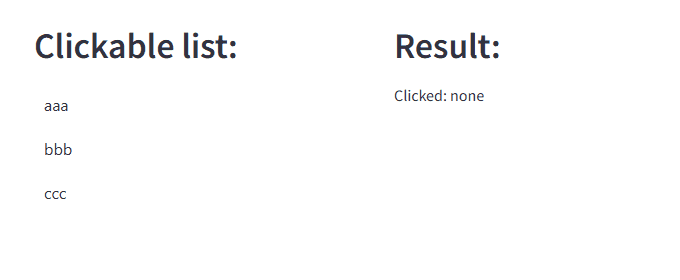

# streamlit-clickable-list

See demo: 

## How to install
```
pip install streamlit-clickable-list
```

## How to use

```python
col1, col2 = st.columns([1, 1])
with col1:
  def on_click(name: str) -> None:
    print(f"clicked: {name}")
    st.session_state['clicked'] = name

  st.header("Clickable list:")
  clickable_list(["aaa", "bbb", "ccc"], on_click, key="clickable_list")

with col2:
  st.header("Result:")
  if "clicked" in st.session_state:
    st.write(f"Clicked: {st.session_state['clicked'] or 'none'}")

```



## For the component development

Based on: https://docs.streamlit.io/develop/concepts/custom-components/intro

### Set up

- Set up python environment and dependencies
  - Used: v3.9
  - If you use `uv`, run:
    ```
    uv sync
    ```
- Set up Node.js environment
  - Used v22.13.1
  - If you use `nvm`, run:
    ```
    nvm use
    ```
- Set up node_modules
  ```
  cd frontend
  npm install
  ```

### Run dev

- Use dev mode
  - Edit `streamlit_clickable_list/__init__.py`
    ```diff
    -_RELEASE = True
    +_RELEASE = False
    ```
- Run dev server
  ```
  cd frontend
  npm start
  ```
- Run streamlit app
  ```
  streamlit run demo.py

  # with WSL
  streamlit run demo.py --server.fileWatcherType=poll --server.address=0.0.0.0
  ```
  - If you use `uv`, add `uv run`

### Build

- Use release mode
  - Edit `streamlit_clickable_list/__init__.py`
    ```diff
    -_RELEASE = False
    +_RELEASE = True
    ```
- Build react app
  ```
  cd frontend
  npm build
  ```

### Release

- Build python
  - If you use `uv`, run:
    ```
    uv build
    ```

#### To Streamlit Community Cloud

Only the first time:
- Log in [Streamlit Community Cloud](https://streamlit.io/cloud)
- "Create app" > "Deploy a public app from GitHub"
- Input info in "Deploy an app"


To publish:
- Generate `requirement.txt`
  - If you use `uv`, run:
    ```
    uv pip compile pyproject.toml > requirements.txt
    ```
- Push github

#### To PyPI

